🐎 Arabian Horse Auction App

A modern, smooth, and beautifully crafted horse bidding application designed in an elegant Arabic-inspired UI style.
Users can add horses, participate in live auctions, explore detailed card views, and manage their assets with a minimal, premium, gulf-style interface.

This app focuses on:

🔸 Real-time bidding experience

🔸 Sleek Arabic-themed visuals

🔸 Smooth navigation with multiple functional screens

🔸 User-friendly horse management system

🔸 A premium modern look with animations and fast performance

📸 Screenshots

 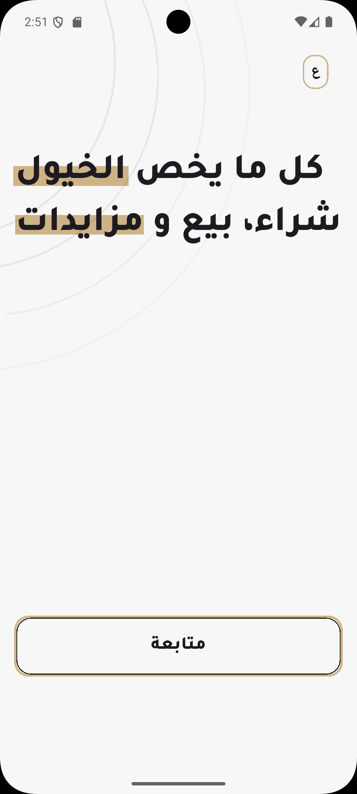  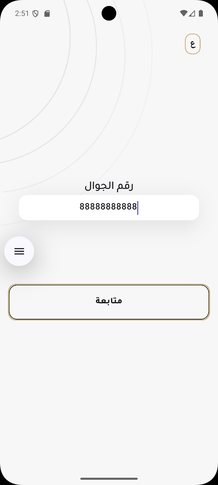 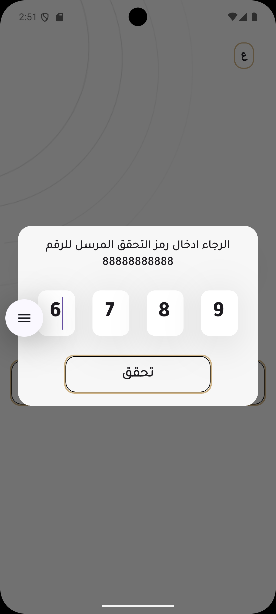 
 
 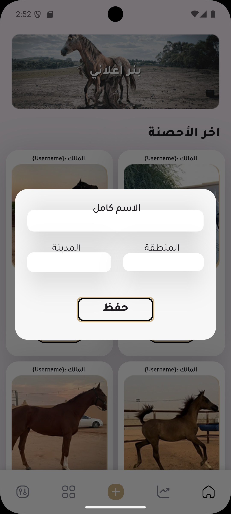 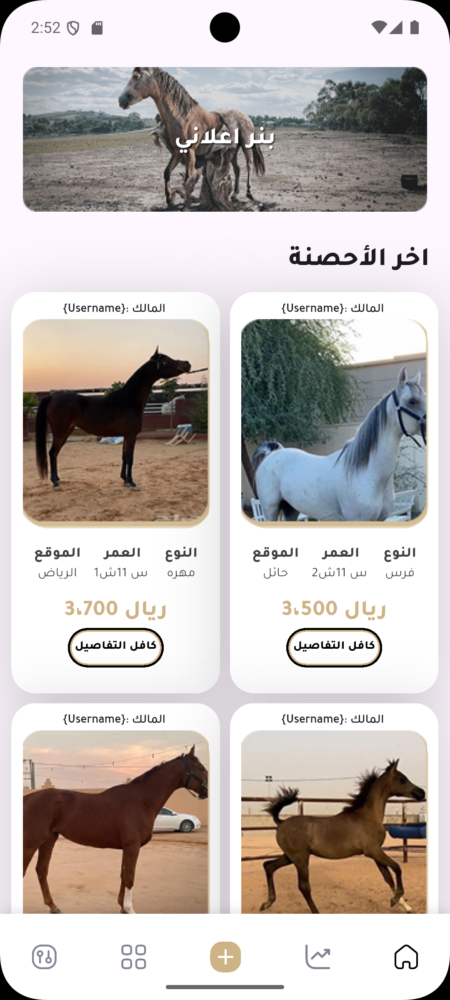 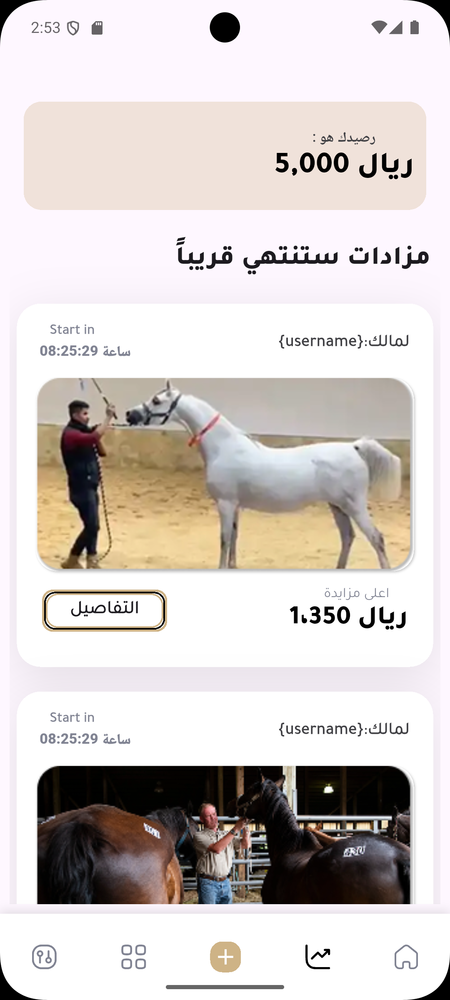 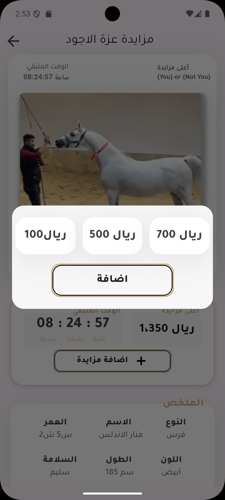 
 
 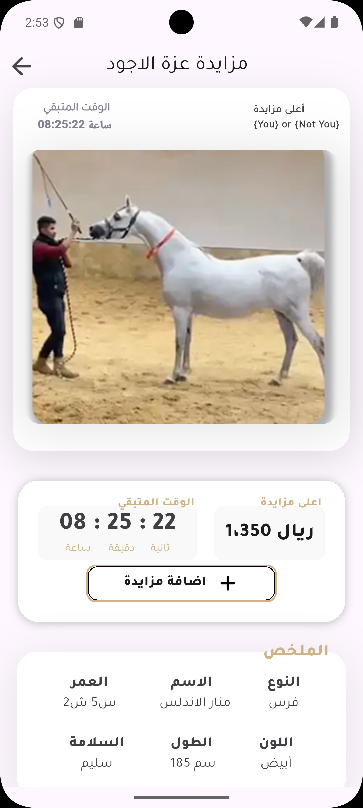 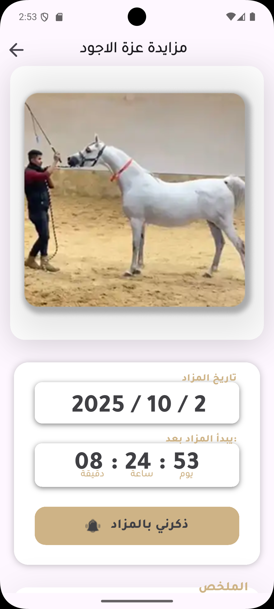  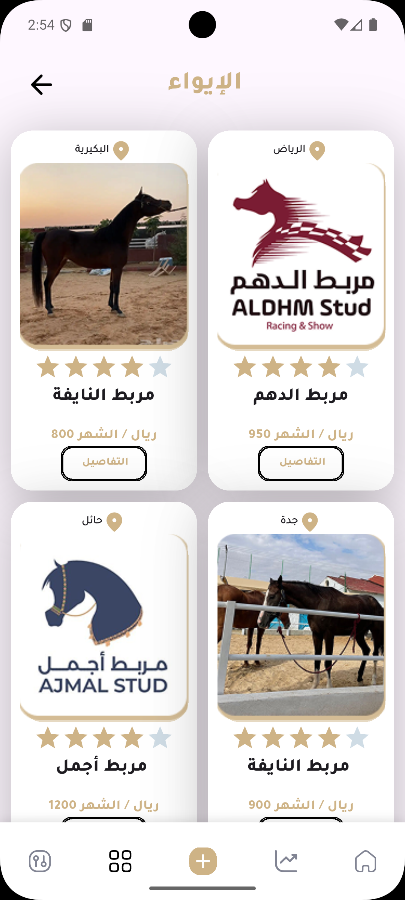 
 
 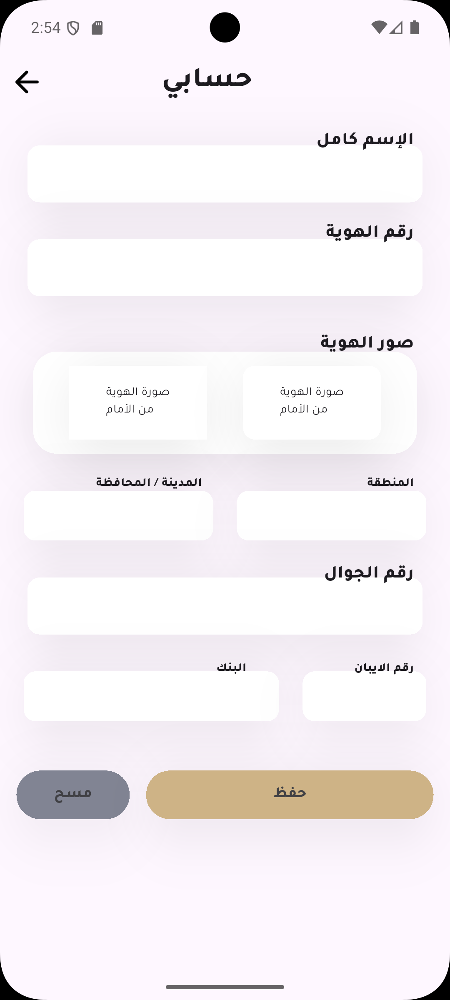 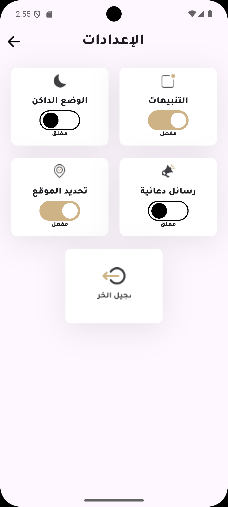 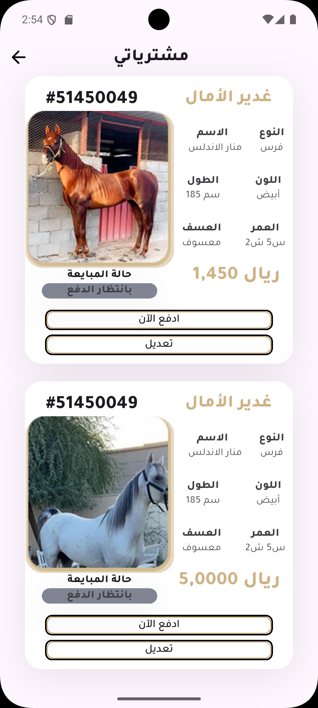 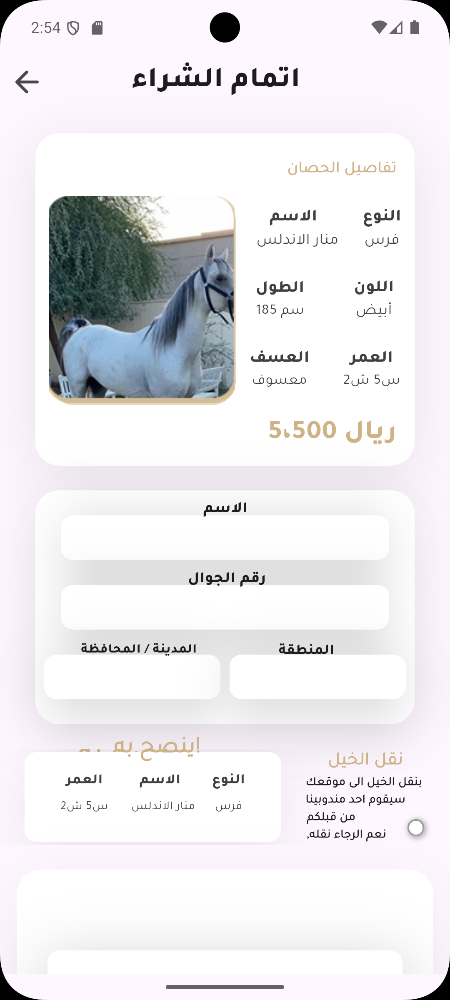 
 
 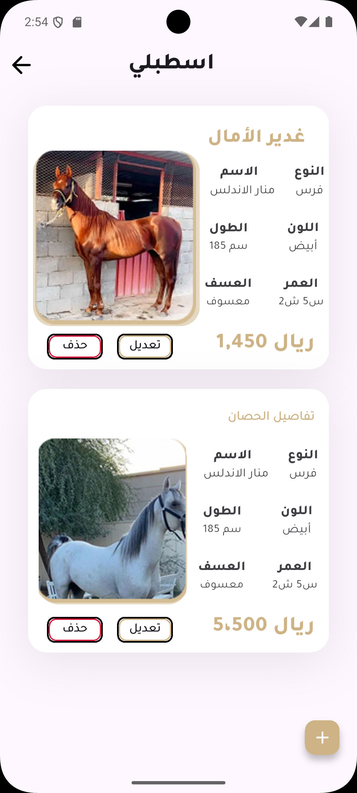 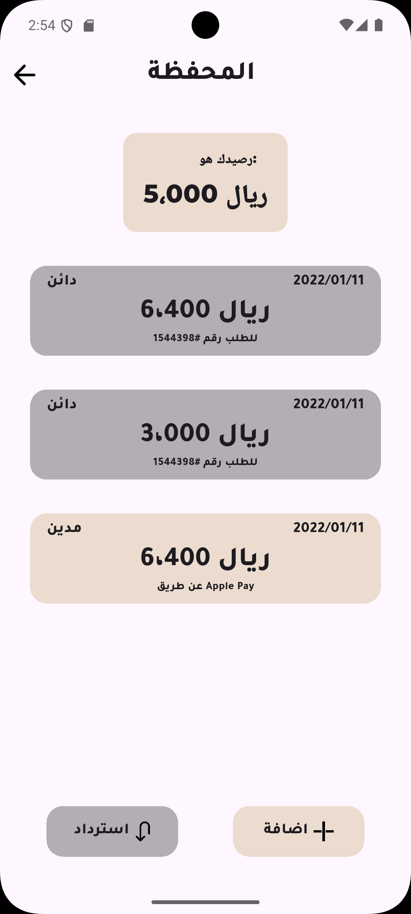 

